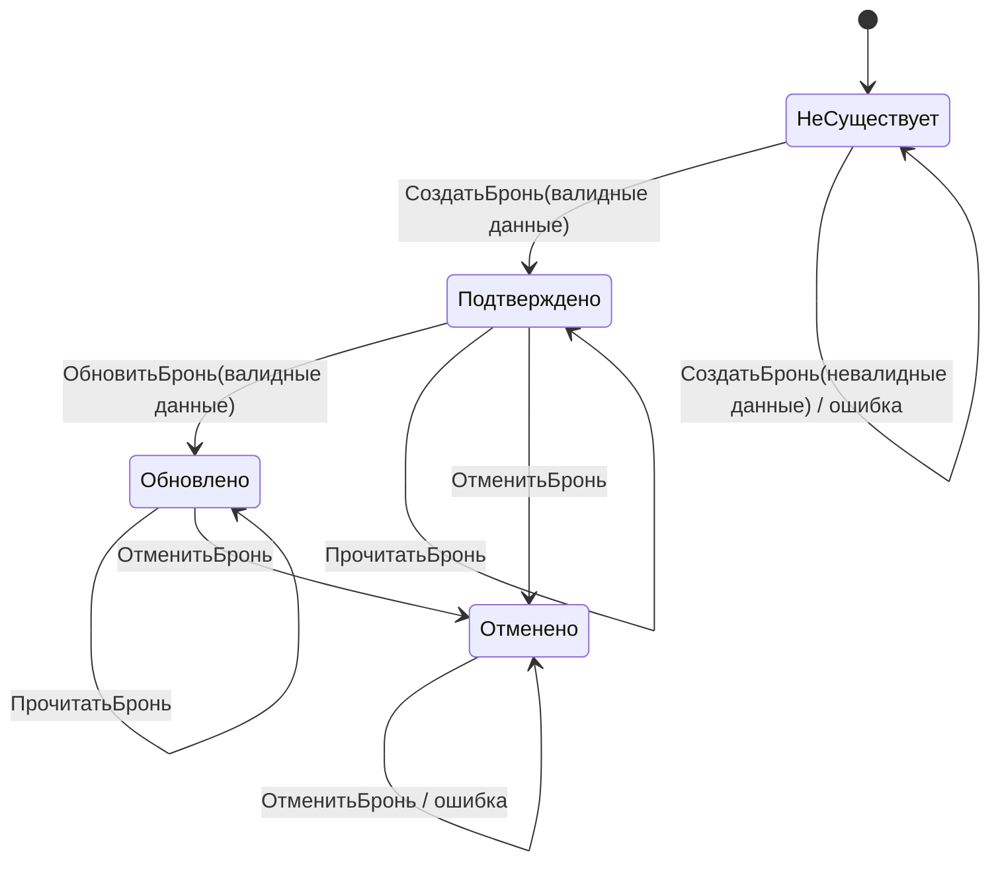

# ЛР1. Тестирование чёрным ящиком (части 3–5)

Объект тестирования: микросервис `deal-service`, сценарий `CreateBooking`.

***

## Часть 3. Функциональная диаграмма и таблица решений

Сценарий: `CreateBooking` — создание бронирования санатория.

### 3.1 Причины и следствия

Таблица 5а — Причины (входные условия)

| ID | Формулировка |
|----|-------------|
| П1 | `client_id` заполнен (не пустая строка) |
| П2 | `sanatorium_id` заполнен (не пустая строка) |
| П3 | `check_in` задана (дата въезда указана, не нулевое значение) |
| П4 | `check_out` задана (дата выезда указана, не нулевое значение) |
| П5 | `check_out > check_in` (корректный диапазон дат) |
| П6 | `guests > 0` (количество гостей положительное) |
| П7 | Репозиторная проверка пройдена (санаторий существует, есть свободные места, даты доступны) |

Таблица 5б — Следствия (выходные результаты)

| ID | Формулировка |
|----|-------------|
| С1 | Ошибка `client_id and sanatorium_id are required` |
| С2 | Ошибка `guests must be greater than zero` |
| С3 | Ошибка `invalid booking date range` |
| С4 | Доменная ошибка репозитория (`sanatorium not found` / `guests exceed capacity` / `not available`) |
| С5 | Успешное создание бронирования (`status = confirmed`) |

### 3.2 Ограничения между причинами

**Е1:** Если П3 = 0 (дата въезда не задана) **или** П4 = 0 (дата выезда не задана), то П5 не вычисляется (обозначается «—»). Причина П5 может принимать значение 0 или 1 только при П3 = 1 **и** П4 = 1.

### 3.3 Функциональная диаграмма (cause-effect graph)

*Вставьте диаграмму.*

Порядок проверок в коде (`BookingService.CreateBooking`):

1. Проверка П1 ∧ П2 (обязательные идентификаторы).
2. Проверка П6 (количество гостей).
3. Проверка П3, П4, П5 через `ValidateBookingDateRange` (даты).
4. Проверка П7 — обращение к репозиторию (существование санатория, вместимость, доступность дат).

### 3.4 Таблица решений

Количество причин: **7**. Полный перебор: **2^7 = 128** комбинаций.

С учётом ограничения Е1 (П5 зависит от П3 и П4), фактическое число уникальных комбинаций: **80**.

Сокращение выполняется объединением строк с одинаковым следствием, где значения отдельных причин не влияют на результат (обозначаются «—»).

Таблица 5 — Сокращённая таблица решений для `CreateBooking`

| № | П1 | П2 | П3 | П4 | П5 | П6 | П7 | С1 | С2 | С3 | С4 | С5 | Покрыто комбинаций |
|---|----|----|----|----|----|----|----|----|----|----|----|----|---------------------|
| 1 | 0  | —  | —  | —  | —  | —  | —  | 1  | 0  | 0  | 0  | 0  | 40 |
| 2 | 1  | 0  | —  | —  | —  | —  | —  | 1  | 0  | 0  | 0  | 0  | 20 |
| 3 | 1  | 1  | —  | —  | —  | 0  | —  | 0  | 1  | 0  | 0  | 0  | 10 |
| 4 | 1  | 1  | 0  | —  | —  | 1  | —  | 0  | 0  | 1  | 0  | 0  | 4  |
| 5 | 1  | 1  | 1  | 0  | —  | 1  | —  | 0  | 0  | 1  | 0  | 0  | 2  |
| 6 | 1  | 1  | 1  | 1  | 0  | 1  | —  | 0  | 0  | 1  | 0  | 0  | 2  |
| 7 | 1  | 1  | 1  | 1  | 1  | 1  | 0  | 0  | 0  | 0  | 1  | 0  | 1  |
| 8 | 1  | 1  | 1  | 1  | 1  | 1  | 1  | 0  | 0  | 0  | 0  | 1  | 1  |
| | | | | | | | | | | | | | **Итого: 80** |

**Обоснование сокращения:**

- **Правило №1** (П1 = 0): если `client_id` не заполнен, результат — С1 независимо от остальных 6 причин. Объединяет 40 комбинаций.
- **Правило №2** (П1 = 1, П2 = 0): если `client_id` заполнен, но `sanatorium_id` — нет, результат — С1 независимо от П3–П7. Объединяет 20 комбинаций.
- **Правило №3** (П1 = 1, П2 = 1, П6 = 0): оба ID заполнены, но `guests ≤ 0` — результат С2 независимо от дат и репозитория. Объединяет 10 комбинаций.
- **Правила №4–6**: ID и guests корректны, но даты невалидны по разным причинам (не задан check_in, не задан check_out, неверный диапазон) — результат С3.
- **Правило №7**: все входные данные корректны, но репозиторная проверка провалена — С4.
- **Правило №8**: все проверки пройдены — С5.

Сокращение: **80 → 8** (в 10 раз).

### 3.5 Тест-кейсы по таблице решений

Таблица 6 — Тест-кейсы по сокращённой таблице решений

| № | Входные данные | Ожидаемый результат | Правило |
|---|---------------|---------------------|---------|
| 1 | `client_id=""`, `sanatorium_id=uuid-san`, `check_in=2026-07-10`, `check_out=2026-07-15`, `guests=2` | Ошибка `client_id and sanatorium_id are required` | №1 |
| 2 | `client_id=uuid-cli`, `sanatorium_id=""`, `check_in=2026-07-10`, `check_out=2026-07-15`, `guests=2` | Ошибка `client_id and sanatorium_id are required` | №2 |
| 3 | `client_id=uuid-cli`, `sanatorium_id=uuid-san`, `check_in=2026-07-10`, `check_out=2026-07-15`, `guests=0` | Ошибка `guests must be greater than zero` | №3 |
| 4 | `client_id=uuid-cli`, `sanatorium_id=uuid-san`, `check_in` не задана, `check_out=2026-07-15`, `guests=2` | Ошибка `invalid booking date range` | №4 |
| 5 | `client_id=uuid-cli`, `sanatorium_id=uuid-san`, `check_in=2026-07-10`, `check_out` не задана, `guests=2` | Ошибка `invalid booking date range` | №5 |
| 6 | `client_id=uuid-cli`, `sanatorium_id=uuid-san`, `check_in=2026-07-15`, `check_out=2026-07-10`, `guests=2` | Ошибка `invalid booking date range` | №6 |
| 7 | `client_id=uuid-cli`, `sanatorium_id=uuid-san`, `check_in=2026-07-10`, `check_out=2026-07-15`, `guests=2`, repo → FAIL | Доменная ошибка (`sanatorium not found` / `guests exceed capacity` / `not available`) | №7 |
| 8 | `client_id=uuid-cli`, `sanatorium_id=uuid-san`, `check_in=2026-07-10`, `check_out=2026-07-15`, `guests=2`, repo → OK | Успешное создание бронирования (`status=confirmed`) | №8 |

***

## Часть 4. Диаграмма состояний и переходов (S&T)

Объект: `Booking` (бронирование).
Аналог в БД: таблица `deal.bookings` (`sql/postgres/01_booking_catalog.sql`).

### 4.1 Состояния

| Состояние | Описание | Признак в системе |
|-----------|----------|-------------------|
| Не существует | Бронирование не существует | Запись отсутствует в БД |
| Подтверждено  | Бронирование создано и подтверждено | `status = 'confirmed'`, `updated_at = created_at` |
| Обновлено     | Бронирование обновлено (изменены даты / кол-во гостей) | `status = 'confirmed'`, `updated_at > created_at` |
| Отменено      | Бронирование отменено | `status = 'cancelled'`, `cancelled_at IS NOT NULL` |

### 4.2 S&T-диаграмма



### 4.3 Таблица переходов

Таблица 7 — Таблица переходов объекта «Бронирование»

| № | Текущее состояние | Событие | Условие | Действие / результат | Следующее состояние |
|---|---|---|---|---|---|
| 1 | Не существует | Создать бронь | Все проверки пройдены | Запись создана, `status=confirmed` | Подтверждено |
| 2 | Не существует | Создать бронь | Проверка не пройдена | Ошибка (С1/С2/С3/С4) | Не существует |
| 3 | Подтверждено | Обновить бронь | Валидные данные | Поля обновлены, `updated_at` изменён | Обновлено |
| 4 | Подтверждено | Обновить бронь | Невалидные данные | Ошибка валидации | Подтверждено |
| 5 | Подтверждено | Отменить бронь | — | `status=cancelled`, `cancelled_at` заполнен | Отменено |
| 6 | Подтверждено | Прочитать бронь | — | Возврат данных бронирования | Подтверждено |
| 7 | Обновлено | Обновить бронь | Валидные данные | Поля обновлены повторно | Обновлено |
| 8 | Обновлено | Обновить бронь | Невалидные данные | Ошибка валидации | Обновлено |
| 9 | Обновлено | Отменить бронь | — | `status=cancelled`, `cancelled_at` заполнен | Отменено |
| 10 | Обновлено | Прочитать бронь | — | Возврат данных | Обновлено |
| 11 | Отменено | Прочитать бронь | — | Возврат данных отменённого бронирования | Отменено |
| 12 | Отменено | Обновить бронь | — | Ошибка `booking not found` | Отменено |
| 13 | Отменено | Отменить бронь | — | Ошибка `booking not found` | Отменено |

### 4.4 Маршруты тестирования

Таблица 8 — Маршруты тестирования через состояния

| № | Маршрут | Переходы (номера из табл. 7) | Назначение |
|---|---------|------------------------------|------------|
| М1 | Не существует → Подтверждено → Обновлено → Отменено | 1 → 3 → 9 | Основной маршрут через все состояния |
| М2 | Не существует → Подтверждено → Отменено | 1 → 5 | Создание и отмена без обновления |
| М3 | Не существует → Подтверждено → Обновлено → Обновлено | 1 → 3 → 7 | Многократное обновление |
| М4 | Не существует → Не существует | 2 | Попытка создания с невалидными данными |
| М5 | Подтверждено → Подтверждено (чтение) | 6 | Чтение подтверждённого бронирования |
| М6 | Обновлено → Обновлено (чтение) | 10 | Чтение обновлённого бронирования |
| М7 | Отменено → Отменено (чтение) | 11 | Чтение отменённого бронирования |

Маршрут **М1** является основным и проходит через все четыре состояния объекта.

***

## Часть 5. Комбинаторика / попарное тестирование

### 5.1 Факторы и уровни значений

Факторы для попарного тестирования берутся из причин (П1–П7) части 3.

| Фактор | Описание | Уровни | Кол-во |
|--------|----------|--------|--------|
| П1 (`client_id`) | Заполнен ли client_id | Заполнен, Пуст | 2 |
| П2 (`sanatorium_id`) | Заполнен ли sanatorium_id | Заполнен, Пуст | 2 |
| П3 (`check_in`) | Задана ли дата въезда | Задана, Не задана | 2 |
| П4 (`check_out`) | Задана ли дата выезда | Задана, Не задана | 2 |
| П5 (диапазон дат) | Корректен ли диапазон дат | Корректный, Некорректный, Не применимо | 3 |
| П6 (`guests`) | Корректно ли количество гостей | Корректный, Некорректный | 2 |
| П7 (репозиторий) | Пройдена ли проверка репозитория | Пройдена, Не пройдена | 2 |

Полный комбинаторный перебор: 2 × 2 × 2 × 2 × 3 × 2 × 2 = **192** комбинации.

### 5.2 Ограничения

Ограничение Е1 из части 3: если П3 = «Не задана» или П4 = «Не задана», то П5 = «Не применимо». Если П3 = «Задана» и П4 = «Задана», то П5 ≠ «Не применимо».

С учётом ограничения число допустимых комбинаций: **80**.

### 5.3 Файл модели для PICT

```txt
ClientID: Filled, Empty
SanatoriumID: Filled, Empty
CheckIn: Provided, Missing
CheckOut: Provided, Missing
DateRange: Valid, Invalid, NA
Guests: Valid, Invalid
RepoCheck: Pass, Fail

IF [CheckIn] = "Missing" THEN [DateRange] = "NA";
IF [CheckOut] = "Missing" THEN [DateRange] = "NA";
IF [CheckIn] = "Provided" AND [CheckOut] = "Provided" THEN [DateRange] <> "NA";
```

### 5.4 Результат выполнения PICT

Таблица 10 — Тест-кейсы, сгенерированные PICT (попарное покрытие)

| № | П1 | П2 | П3 | П4 | П5 | П6 | П7 | Ожидаемый результат |
|---|----|----|----|----|----|----|----|--------------------|
| 1 | Заполнен | Пуст | Задана | Задана | Корректный | Корректный | Пройдена | С1: Ошибка `client_id and sanatorium_id are required` |
| 2 | Заполнен | Заполнен | Не задана | Не задана | НП | Некорректный | Не пройдена | С2: Ошибка `guests must be greater than zero` |
| 3 | Пуст | Заполнен | Задана | Не задана | НП | Корректный | Пройдена | С1: Ошибка `client_id and sanatorium_id are required` |
| 4 | Пуст | Заполнен | Задана | Задана | Корректный | Некорректный | Не пройдена | С1: Ошибка `client_id and sanatorium_id are required` |
| 5 | Пуст | Пуст | Задана | Задана | Некорректный | Корректный | Не пройдена | С1: Ошибка `client_id and sanatorium_id are required` |
| 6 | Заполнен | Заполнен | Задана | Задана | Некорректный | Некорректный | Пройдена | С2: Ошибка `guests must be greater than zero` |
| 7 | Пуст | Пуст | Не задана | Задана | НП | Корректный | Пройдена | С1: Ошибка `client_id and sanatorium_id are required` |
| 8 | Пуст | Пуст | Задана | Не задана | НП | Некорректный | Не пройдена | С1: Ошибка `client_id and sanatorium_id are required` |

Обозначение: НП — не применимо.

Ожидаемый результат определяется по порядку проверок из части 3: сначала П1 ∧ П2, затем П6, затем П3 ∧ П4 ∧ П5, затем П7. Срабатывает первая не пройденная проверка.

### 5.5 Анализ результатов

| Показатель | Значение |
|-----------|----------|
| Полный комбинаторный перебор (без ограничений) | 192 |
| Допустимых комбинаций (с учётом ограничения Е1) | 80 |
| Тест-кейсов попарного покрытия (PICT) | **8** |
| Сокращение от полного перебора | в 24 раза |
| Сокращение от допустимых комбинаций | в 10 раз |

Попарное тестирование обеспечивает покрытие всех пар значений факторов при значительном сокращении числа тестов: с 192 (полный перебор) или 80 (с ограничениями) до 8 тест-кейсов.
