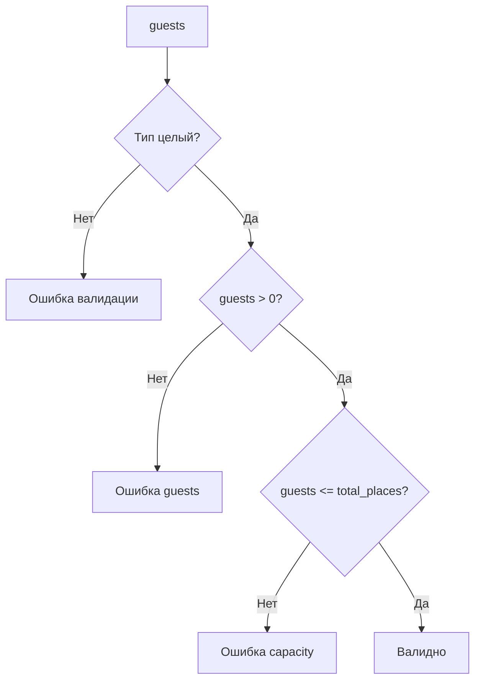
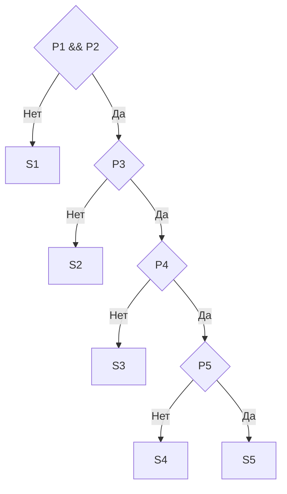
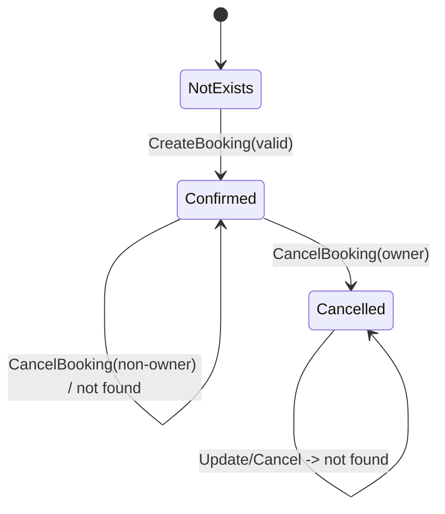
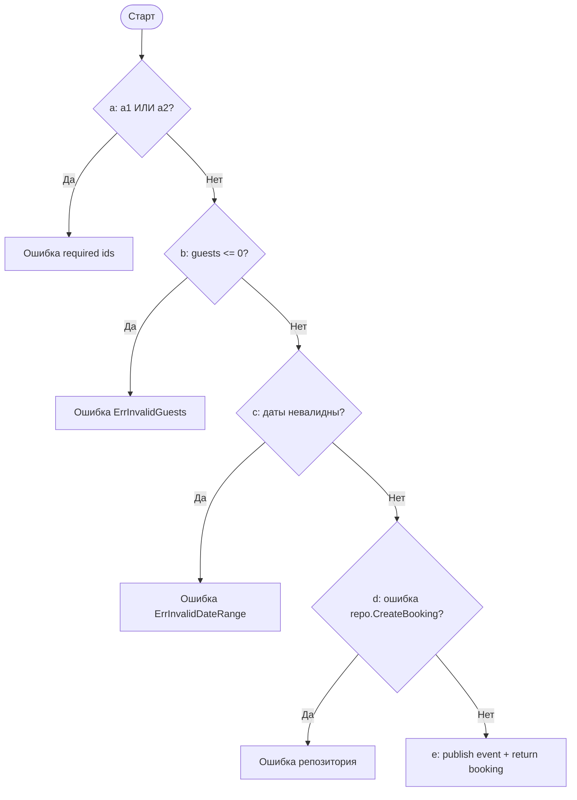
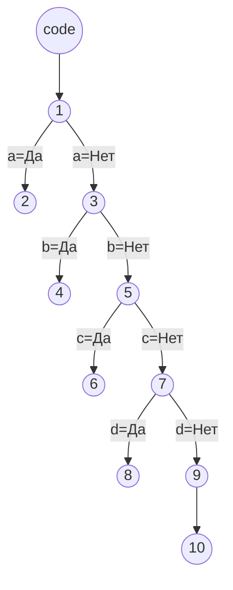

# Лабораторные работы №1 и №2 по тестированию

## Титульный блок
- Дисциплина: Тестирование ПО
- Проект: `src/go-microservices/deal-service`
- Студент: [Заполнить]
- Группа: [Заполнить]
- Преподаватель: [Заполнить]
- Год: 2026

## Цель работы
Сформировать и обосновать тесты для микросервиса `deal-service` методами black-box (ЛР1) и white-box (ЛР2).

## Объект тестирования
- `deal-service`, сценарии бронирования.
- Ключевые места: `BookingService.CreateBooking`, `BookingService.UpdateBooking`, репозиторные проверки доступности.

***

## ЛР1. Тестирование черным ящиком

### Часть 1. Классы эквивалентности

#### 1.1 Техническое задание на поле
Поле: `guests`.
1. Тип: целое число.
2. Ограничение: `guests > 0`.
3. Ограничение: `guests <= total_places`.
4. Пустые/нечисловые значения недопустимы.

#### 1.2 Классы эквивалентности (таблично)

Таблица 1 - Классы эквивалентов для поля «guests»

| № | Входные данные | Правильность класса |
|---|---|---|
| 1 | `1..N`, где `N=total_places` | + |
| 2 | `0` | - |
| 3 | отрицательные значения (`-1`, `-2`, ...) | - |
| 4 | `N+1` и выше | - |
| 5 | нечисловое значение (`\"2\"`, `abc`) | - |
| 6 | пустое/отсутствующее поле | - |

#### 1.3 Классы эквивалентности (графически)



#### 1.4 Тест-кейсы по КЭ

Таблица 2 – Тесты для поля «guests»

| Входные данные | Предполагаемые выходные данные | ЭК | Результат |
|---|---|---|---|
| `guests=2`, `total_places=3` | Проверка поля `guests` проходит | 1 | Ожидаемо: успешно |
| `guests=0` | Ошибка `guests must be greater than zero` | 2 | Ожидаемо: ошибка |
| `guests=-1` | Ошибка `guests must be greater than zero` | 3 | Ожидаемо: ошибка |
| `guests=4`, `total_places=3` | Ошибка `guests exceed sanatorium capacity` | 4 | Ожидаемо: ошибка |
| `guests=\"2\"` | Ошибка валидации входного JSON | 5 | Ожидаемо: ошибка |
| отсутствует поле `guests` | Ошибка валидации входных данных | 6 | Ожидаемо: ошибка |

***

### Часть 2. Граничные условия

#### 2.1 Границы

Таблица 3 - Определение границ значений для поля «guests»

| Граница | Значение | Диапазон |
|---|---|---|
| Физическая | Минимум валидного числа гостей | `1` |
| Физическая | Верхняя граница вместимости | `N=total_places` |
| Логическая | Ноль и отрицательные значения недопустимы | `...,-1,0` |
| Технологическая | Ограничение INT в БД | `[-2147483648..2147483647]` |
| Произвольная | Бизнес-правило сервиса | `1..N` |

#### 2.2 Тесты на границах

Таблица 4 - Тестирование граничных значений поля «guests»

| Входные данные | Предполагаемые выходные данные | Граница | Результат | Уровень ошибки |
|---|---|---|---|---|
| `guests=1`, `N=3` | Значение принято | Физическая/Произвольная | Ожидаемо: успешно | - |
| `guests=3`, `N=3` | Значение принято | Физическая/Произвольная | Ожидаемо: успешно | - |
| `guests=0` | Ошибка `guests must be greater than zero` | Логическая | Ожидаемо: ошибка | - |
| `guests=-1` | Ошибка `guests must be greater than zero` | Логическая | Ожидаемо: ошибка | - |
| `guests=4`, `N=3` | Ошибка `guests exceed sanatorium capacity` | Произвольная | Ожидаемо: ошибка | - |
| `guests=2147483648` | Ошибка валидации/десериализации/БД | Технологическая | Ожидаемо: ошибка | - |

***

### Часть 3. Функциональная диаграмма и таблица решений

Сценарий: `CreateBooking`.
Количество причин сокращено до 5, полный перебор: `2^5 = 32`.

#### 3.1 Причины и следствия

| ID | Формулировка |
|---|---|
| P1 | `client_id` заполнен |
| P2 | `sanatorium_id` заполнен |
| P3 | `guests > 0` |
| P4 | `check_out > check_in` |
| P5 | Репозиторная проверка пройдена |
| S1 | Ошибка `client_id and sanatorium_id are required` |
| S2 | Ошибка `guests must be greater than zero` |
| S3 | Ошибка `invalid booking date range` |
| S4 | Доменная ошибка репозитория |
| S5 | Успешное создание бронирования |

#### 3.2 Cause-effect диаграмма



#### 3.3 Таблица решений (все 32 случая)

Таблица 5 – Таблица решений для сценария `CreateBooking`

| № | P1 | P2 | P3 | P4 | P5 | S1 | S2 | S3 | S4 | S5 |
|---|---|---|---|---|---|---|---|---|---|---|
| 1 | 0 | 0 | 0 | 0 | 0 | 1 | 0 | 0 | 0 | 0 |
| 2 | 0 | 0 | 0 | 0 | 1 | 1 | 0 | 0 | 0 | 0 |
| 3 | 0 | 0 | 0 | 1 | 0 | 1 | 0 | 0 | 0 | 0 |
| 4 | 0 | 0 | 0 | 1 | 1 | 1 | 0 | 0 | 0 | 0 |
| 5 | 0 | 0 | 1 | 0 | 0 | 1 | 0 | 0 | 0 | 0 |
| 6 | 0 | 0 | 1 | 0 | 1 | 1 | 0 | 0 | 0 | 0 |
| 7 | 0 | 0 | 1 | 1 | 0 | 1 | 0 | 0 | 0 | 0 |
| 8 | 0 | 0 | 1 | 1 | 1 | 1 | 0 | 0 | 0 | 0 |
| 9 | 0 | 1 | 0 | 0 | 0 | 1 | 0 | 0 | 0 | 0 |
| 10 | 0 | 1 | 0 | 0 | 1 | 1 | 0 | 0 | 0 | 0 |
| 11 | 0 | 1 | 0 | 1 | 0 | 1 | 0 | 0 | 0 | 0 |
| 12 | 0 | 1 | 0 | 1 | 1 | 1 | 0 | 0 | 0 | 0 |
| 13 | 0 | 1 | 1 | 0 | 0 | 1 | 0 | 0 | 0 | 0 |
| 14 | 0 | 1 | 1 | 0 | 1 | 1 | 0 | 0 | 0 | 0 |
| 15 | 0 | 1 | 1 | 1 | 0 | 1 | 0 | 0 | 0 | 0 |
| 16 | 0 | 1 | 1 | 1 | 1 | 1 | 0 | 0 | 0 | 0 |
| 17 | 1 | 0 | 0 | 0 | 0 | 1 | 0 | 0 | 0 | 0 |
| 18 | 1 | 0 | 0 | 0 | 1 | 1 | 0 | 0 | 0 | 0 |
| 19 | 1 | 0 | 0 | 1 | 0 | 1 | 0 | 0 | 0 | 0 |
| 20 | 1 | 0 | 0 | 1 | 1 | 1 | 0 | 0 | 0 | 0 |
| 21 | 1 | 0 | 1 | 0 | 0 | 1 | 0 | 0 | 0 | 0 |
| 22 | 1 | 0 | 1 | 0 | 1 | 1 | 0 | 0 | 0 | 0 |
| 23 | 1 | 0 | 1 | 1 | 0 | 1 | 0 | 0 | 0 | 0 |
| 24 | 1 | 0 | 1 | 1 | 1 | 1 | 0 | 0 | 0 | 0 |
| 25 | 1 | 1 | 0 | 0 | 0 | 0 | 1 | 0 | 0 | 0 |
| 26 | 1 | 1 | 0 | 0 | 1 | 0 | 1 | 0 | 0 | 0 |
| 27 | 1 | 1 | 0 | 1 | 0 | 0 | 1 | 0 | 0 | 0 |
| 28 | 1 | 1 | 0 | 1 | 1 | 0 | 1 | 0 | 0 | 0 |
| 29 | 1 | 1 | 1 | 0 | 0 | 0 | 0 | 1 | 0 | 0 |
| 30 | 1 | 1 | 1 | 0 | 1 | 0 | 0 | 1 | 0 | 0 |
| 31 | 1 | 1 | 1 | 1 | 0 | 0 | 0 | 0 | 1 | 0 |
| 32 | 1 | 1 | 1 | 1 | 1 | 0 | 0 | 0 | 0 | 1 |

#### 3.4 Тест-кейсы (все 32 случая)

Таблица 6 – Тестирование по функциональной диаграмме

| Набор данных | Результат |
|---|---|
| `№1: P1=0,P2=0,P3=0,P4=0,P5=0; client_id=\"\"; sanatorium_id=\"\"; guests=0; dates=2026-07-15..2026-07-10; repo_precheck=FAIL` | Ошибка `client_id and sanatorium_id are required` |
| `№2: P1=0,P2=0,P3=0,P4=0,P5=1; client_id=\"\"; sanatorium_id=\"\"; guests=0; dates=2026-07-15..2026-07-10; repo_precheck=OK` | Ошибка `client_id and sanatorium_id are required` |
| `№3: P1=0,P2=0,P3=0,P4=1,P5=0; client_id=\"\"; sanatorium_id=\"\"; guests=0; dates=2026-07-10..2026-07-15; repo_precheck=FAIL` | Ошибка `client_id and sanatorium_id are required` |
| `№4: P1=0,P2=0,P3=0,P4=1,P5=1; client_id=\"\"; sanatorium_id=\"\"; guests=0; dates=2026-07-10..2026-07-15; repo_precheck=OK` | Ошибка `client_id and sanatorium_id are required` |
| `№5: P1=0,P2=0,P3=1,P4=0,P5=0; client_id=\"\"; sanatorium_id=\"\"; guests=2; dates=2026-07-15..2026-07-10; repo_precheck=FAIL` | Ошибка `client_id and sanatorium_id are required` |
| `№6: P1=0,P2=0,P3=1,P4=0,P5=1; client_id=\"\"; sanatorium_id=\"\"; guests=2; dates=2026-07-15..2026-07-10; repo_precheck=OK` | Ошибка `client_id and sanatorium_id are required` |
| `№7: P1=0,P2=0,P3=1,P4=1,P5=0; client_id=\"\"; sanatorium_id=\"\"; guests=2; dates=2026-07-10..2026-07-15; repo_precheck=FAIL` | Ошибка `client_id and sanatorium_id are required` |
| `№8: P1=0,P2=0,P3=1,P4=1,P5=1; client_id=\"\"; sanatorium_id=\"\"; guests=2; dates=2026-07-10..2026-07-15; repo_precheck=OK` | Ошибка `client_id and sanatorium_id are required` |
| `№9: P1=0,P2=1,P3=0,P4=0,P5=0; client_id=\"\"; sanatorium_id=uuid-sanatorium; guests=0; dates=2026-07-15..2026-07-10; repo_precheck=FAIL` | Ошибка `client_id and sanatorium_id are required` |
| `№10: P1=0,P2=1,P3=0,P4=0,P5=1; client_id=\"\"; sanatorium_id=uuid-sanatorium; guests=0; dates=2026-07-15..2026-07-10; repo_precheck=OK` | Ошибка `client_id and sanatorium_id are required` |
| `№11: P1=0,P2=1,P3=0,P4=1,P5=0; client_id=\"\"; sanatorium_id=uuid-sanatorium; guests=0; dates=2026-07-10..2026-07-15; repo_precheck=FAIL` | Ошибка `client_id and sanatorium_id are required` |
| `№12: P1=0,P2=1,P3=0,P4=1,P5=1; client_id=\"\"; sanatorium_id=uuid-sanatorium; guests=0; dates=2026-07-10..2026-07-15; repo_precheck=OK` | Ошибка `client_id and sanatorium_id are required` |
| `№13: P1=0,P2=1,P3=1,P4=0,P5=0; client_id=\"\"; sanatorium_id=uuid-sanatorium; guests=2; dates=2026-07-15..2026-07-10; repo_precheck=FAIL` | Ошибка `client_id and sanatorium_id are required` |
| `№14: P1=0,P2=1,P3=1,P4=0,P5=1; client_id=\"\"; sanatorium_id=uuid-sanatorium; guests=2; dates=2026-07-15..2026-07-10; repo_precheck=OK` | Ошибка `client_id and sanatorium_id are required` |
| `№15: P1=0,P2=1,P3=1,P4=1,P5=0; client_id=\"\"; sanatorium_id=uuid-sanatorium; guests=2; dates=2026-07-10..2026-07-15; repo_precheck=FAIL` | Ошибка `client_id and sanatorium_id are required` |
| `№16: P1=0,P2=1,P3=1,P4=1,P5=1; client_id=\"\"; sanatorium_id=uuid-sanatorium; guests=2; dates=2026-07-10..2026-07-15; repo_precheck=OK` | Ошибка `client_id and sanatorium_id are required` |
| `№17: P1=1,P2=0,P3=0,P4=0,P5=0; client_id=uuid-client; sanatorium_id=\"\"; guests=0; dates=2026-07-15..2026-07-10; repo_precheck=FAIL` | Ошибка `client_id and sanatorium_id are required` |
| `№18: P1=1,P2=0,P3=0,P4=0,P5=1; client_id=uuid-client; sanatorium_id=\"\"; guests=0; dates=2026-07-15..2026-07-10; repo_precheck=OK` | Ошибка `client_id and sanatorium_id are required` |
| `№19: P1=1,P2=0,P3=0,P4=1,P5=0; client_id=uuid-client; sanatorium_id=\"\"; guests=0; dates=2026-07-10..2026-07-15; repo_precheck=FAIL` | Ошибка `client_id and sanatorium_id are required` |
| `№20: P1=1,P2=0,P3=0,P4=1,P5=1; client_id=uuid-client; sanatorium_id=\"\"; guests=0; dates=2026-07-10..2026-07-15; repo_precheck=OK` | Ошибка `client_id and sanatorium_id are required` |
| `№21: P1=1,P2=0,P3=1,P4=0,P5=0; client_id=uuid-client; sanatorium_id=\"\"; guests=2; dates=2026-07-15..2026-07-10; repo_precheck=FAIL` | Ошибка `client_id and sanatorium_id are required` |
| `№22: P1=1,P2=0,P3=1,P4=0,P5=1; client_id=uuid-client; sanatorium_id=\"\"; guests=2; dates=2026-07-15..2026-07-10; repo_precheck=OK` | Ошибка `client_id and sanatorium_id are required` |
| `№23: P1=1,P2=0,P3=1,P4=1,P5=0; client_id=uuid-client; sanatorium_id=\"\"; guests=2; dates=2026-07-10..2026-07-15; repo_precheck=FAIL` | Ошибка `client_id and sanatorium_id are required` |
| `№24: P1=1,P2=0,P3=1,P4=1,P5=1; client_id=uuid-client; sanatorium_id=\"\"; guests=2; dates=2026-07-10..2026-07-15; repo_precheck=OK` | Ошибка `client_id and sanatorium_id are required` |
| `№25: P1=1,P2=1,P3=0,P4=0,P5=0; client_id=uuid-client; sanatorium_id=uuid-sanatorium; guests=0; dates=2026-07-15..2026-07-10; repo_precheck=FAIL` | Ошибка `guests must be greater than zero` |
| `№26: P1=1,P2=1,P3=0,P4=0,P5=1; client_id=uuid-client; sanatorium_id=uuid-sanatorium; guests=0; dates=2026-07-15..2026-07-10; repo_precheck=OK` | Ошибка `guests must be greater than zero` |
| `№27: P1=1,P2=1,P3=0,P4=1,P5=0; client_id=uuid-client; sanatorium_id=uuid-sanatorium; guests=0; dates=2026-07-10..2026-07-15; repo_precheck=FAIL` | Ошибка `guests must be greater than zero` |
| `№28: P1=1,P2=1,P3=0,P4=1,P5=1; client_id=uuid-client; sanatorium_id=uuid-sanatorium; guests=0; dates=2026-07-10..2026-07-15; repo_precheck=OK` | Ошибка `guests must be greater than zero` |
| `№29: P1=1,P2=1,P3=1,P4=0,P5=0; client_id=uuid-client; sanatorium_id=uuid-sanatorium; guests=2; dates=2026-07-15..2026-07-10; repo_precheck=FAIL` | Ошибка `invalid booking date range` |
| `№30: P1=1,P2=1,P3=1,P4=0,P5=1; client_id=uuid-client; sanatorium_id=uuid-sanatorium; guests=2; dates=2026-07-15..2026-07-10; repo_precheck=OK` | Ошибка `invalid booking date range` |
| `№31: P1=1,P2=1,P3=1,P4=1,P5=0; client_id=uuid-client; sanatorium_id=uuid-sanatorium; guests=2; dates=2026-07-10..2026-07-15; repo_precheck=FAIL` | Доменная ошибка (`sanatorium not found` / `guests exceed capacity` / `not available`) |
| `№32: P1=1,P2=1,P3=1,P4=1,P5=1; client_id=uuid-client; sanatorium_id=uuid-sanatorium; guests=2; dates=2026-07-10..2026-07-15; repo_precheck=OK` | Успешное создание бронирования (`status=confirmed`) |

***

### Часть 4. Диаграмма состояний и переходов (S&T)

Объект: `Booking`.
Аналог в БД: таблица `deal.bookings` (`sql/postgres/01_booking_catalog.sql`).

#### 4.1 S&T диаграмма



#### 4.2 Таблица переходов

| Текущее состояние | Событие | Условие | Действие/результат | Следующее состояние |
|---|---|---|---|---|
| NotExists | CreateBooking | Проверки пройдены | Создание записи | Confirmed |
| Confirmed | UpdateBooking | Owner + валидные данные | Обновление | Confirmed |
| Confirmed | CancelBooking | Owner | Отмена | Cancelled |
| Confirmed | CancelBooking | NonOwner | Ошибка `booking not found` | Confirmed |
| Cancelled | ReadBooking | Owner | Чтение отмененного | Cancelled |

***

### Часть 5. Комбинаторика / попарное тестирование

#### 5.1 Основные случаи, которые необходимо проверить

- корректное создание бронирования;
- создание бронирования с невалидными датами;
- создание бронирования с невалидным числом гостей;
- обновление бронирования владельцем;
- обновление бронирования не-владельцем;
- отмена бронирования владельцем;
- отмена бронирования не-владельцем;
- чтение бронирования владельцем (`Confirmed` и `Cancelled`);
- чтение бронирования не-владельцем.

#### 5.2 Файл для инструмента

```txt
State: NotExists, Confirmed, Cancelled
Operation: Create, Update, Cancel, Read
Ownership: Owner, NonOwner
DateRangeValidity: Valid, Invalid, NA
GuestsValidity: Valid, Invalid, NA
Availability: Available, NotAvailable, NA

IF [Operation] = "Create" THEN [State] = "NotExists";
IF [Operation] = "Create" THEN [Ownership] = "Owner";
IF [Operation] = "Create" THEN [DateRangeValidity] <> "NA";
IF [Operation] = "Create" THEN [GuestsValidity] <> "NA";
IF [Operation] = "Create" THEN [Availability] <> "NA";

IF [Operation] = "Update" THEN [State] = "Confirmed";
IF [Operation] = "Update" THEN [DateRangeValidity] <> "NA";
IF [Operation] = "Update" THEN [GuestsValidity] <> "NA";
IF [Operation] = "Update" THEN [Availability] <> "NA";

IF [Operation] = "Cancel" THEN [State] = "Confirmed";
IF [Operation] = "Cancel" THEN [DateRangeValidity] = "NA";
IF [Operation] = "Cancel" THEN [GuestsValidity] = "NA";
IF [Operation] = "Cancel" THEN [Availability] = "NA";

IF [Operation] = "Read" THEN [DateRangeValidity] = "NA";
IF [Operation] = "Read" THEN [GuestsValidity] = "NA";
IF [Operation] = "Read" THEN [Availability] = "NA";
```

#### 5.3 Результат выполнения (тест-кейсы)

Таблица 7 – Тесты, сгенерированные программой PICT

| Номер теста | Параметры теста | Результат |
|---|---|---|
| №1 | State=NotExists; Operation=Create; Ownership=Owner; DateRangeValidity=Valid; GuestsValidity=Invalid; Availability=Available | Ошибка `guests must be greater than zero` |
| №2 | State=Cancelled; Operation=Read; Ownership=Owner; DateRangeValidity=NA; GuestsValidity=NA; Availability=NA | Успешное чтение отмененного бронирования |
| №3 | State=Confirmed; Operation=Cancel; Ownership=Owner; DateRangeValidity=NA; GuestsValidity=NA; Availability=NA | Переход в `Cancelled` |
| №4 | State=Confirmed; Operation=Update; Ownership=NonOwner; DateRangeValidity=Invalid; GuestsValidity=Valid; Availability=NotAvailable | Ошибка `invalid booking date range` |
| №5 | State=Confirmed; Operation=Update; Ownership=NonOwner; DateRangeValidity=Invalid; GuestsValidity=Invalid; Availability=Available | Ошибка `guests must be greater than zero` |
| №6 | State=NotExists; Operation=Create; Ownership=Owner; DateRangeValidity=Invalid; GuestsValidity=Valid; Availability=NotAvailable | Ошибка `invalid booking date range` |
| №7 | State=Confirmed; Operation=Cancel; Ownership=NonOwner; DateRangeValidity=NA; GuestsValidity=NA; Availability=NA | Ошибка `booking not found` |
| №8 | State=Cancelled; Operation=Read; Ownership=NonOwner; DateRangeValidity=NA; GuestsValidity=NA; Availability=NA | Ошибка `booking not found` |
| №9 | State=NotExists; Operation=Read; Ownership=NonOwner; DateRangeValidity=NA; GuestsValidity=NA; Availability=NA | Ошибка `booking not found` |
| №10 | State=Confirmed; Operation=Update; Ownership=NonOwner; DateRangeValidity=Valid; GuestsValidity=Valid; Availability=Available | Ошибка `booking not found` |
| №11 | State=Confirmed; Operation=Read; Ownership=Owner; DateRangeValidity=NA; GuestsValidity=NA; Availability=NA | Успешное чтение бронирования |
| №12 | State=Confirmed; Operation=Update; Ownership=Owner; DateRangeValidity=Valid; GuestsValidity=Invalid; Availability=NotAvailable | Ошибка `guests must be greater than zero` |

#### 5.4 Анализ результатов

- Комбинаторных переборов входных данных: `648`.
- Валидных комбинаций с ограничениями: `32`.
- Тест-кейсов попарного тестирования: `12`.

***

## ЛР2. Тестирование белым ящиком

Функция: `BookingService.CreateBooking`.

Листинг 2 - Фрагмент кода с пометками операторов

```go
func (s *BookingService) CreateBooking(ctx context.Context, traceID string, in CreateBookingInput) (domain.Booking, error) {
	// a: проверка обязательных полей (a1 OR a2)
	// a1: client_id пустой, a2: sanatorium_id пустой
	if strings.TrimSpace(in.ClientID) == "" || strings.TrimSpace(in.SanatoriumID) == "" {
		return domain.Booking{}, fmt.Errorf("client_id and sanatorium_id are required")
	}

	// b: проверка количества гостей
	if in.Guests <= 0 {
		return domain.Booking{}, ErrInvalidGuests
	}

	// c: проверка диапазона дат
	if err := ValidateBookingDateRange(in.CheckIn, in.CheckOut); err != nil {
		return domain.Booking{}, err
	}

	// d: создание в репозитории + проверка ошибки
	booking, err := s.repo.CreateBooking(ctx, repository.NewBooking{
		ClientID:     in.ClientID,
		SanatoriumID: in.SanatoriumID,
		CheckIn:      in.CheckIn,
		CheckOut:     in.CheckOut,
		Guests:       in.Guests,
	})
	if err != nil {
		return domain.Booking{}, err
	}

	// e: публикация события и успешный выход
	s.publishBookingEvent(ctx, traceID, "booking.confirmed", map[string]any{
		"booking_id":    booking.ID,
		"client_id":     booking.ClientID,
		"sanatorium_id": booking.SanatoriumID,
		"check_in":      booking.CheckIn,
		"check_out":     booking.CheckOut,
		"guests":        booking.Guests,
		"status":        booking.Status,
	})
	return booking, nil
}
```

Диаграмма 1 - Логика проверок (для начала раздела ЛР2)



### Часть 1. Покрытие операторов

| № | Операторы | Входные данные | Выходные данные |
|---|---|---|---|
| 1 | `a` | `client_id=""`, `sanatorium_id=uuid`, остальные поля валидны | Ошибка `client_id and sanatorium_id are required` |
| 2 | `a, b` | оба ID валидны, `guests=0` | `ErrInvalidGuests` |
| 3 | `a, b, c` | ID валидны, `guests=2`, `check_out<=check_in` | `ErrInvalidDateRange` |
| 4 | `a, b, c, d` | валидный ввод, `repo.CreateBooking` возвращает ошибку | Ошибка репозитория |
| 5 | `a, b, c, d, e` | валидный ввод, `repo.CreateBooking` успешен | Успешное создание брони |

### Часть 2. Покрытие решений

| № | Решения | Входные данные | Выходные данные |
|---|---|---|---|
| 1 | `a=Да` | пустой хотя бы один ID | Ошибка required ids |
| 2 | `a=Нет, b=Да` | ID валидны, `guests<=0` | `ErrInvalidGuests` |
| 3 | `a=Нет, b=Нет, c=Да` | ID валидны, `guests>0`, невалидные даты | `ErrInvalidDateRange` |
| 4 | `a=Нет, b=Нет, c=Нет, d=Да` | валидный ввод, ошибка репозитория | Ошибка репозитория |
| 5 | `a=Нет, b=Нет, c=Нет, d=Нет` | валидный ввод, repo success | Успех |

### Часть 3. Покрытие условий

| № | Условие | Входные данные | Выходные данные |
|---|---|---|---|
| 1 | `a1=Да, a2=Нет` | `client_id=""`, `sanatorium_id=uuid` | Ошибка required ids |
| 2 | `a1=Нет, a2=Да` | `client_id=uuid`, `sanatorium_id=""` | Ошибка required ids |
| 3 | `a1=Нет, a2=Нет, b=Да` | ID валидны, `guests=0` | `ErrInvalidGuests` |
| 4 | `a1=Нет, a2=Нет, b=Нет, c=Да` | ID валидны, `guests=2`, даты невалидны | `ErrInvalidDateRange` |
| 5 | `a1=Нет, a2=Нет, b=Нет, c=Нет, d=Да` | валидный ввод, repo error | Ошибка репозитория |
| 6 | `a1=Нет, a2=Нет, b=Нет, c=Нет, d=Нет` | валидный ввод, repo success | Успех |

### Часть 4. Покрытие решений и условий

| № | Условие | Входные данные | Выходные данные |
|---|---|---|---|
| 1 | `a=Да` (`a1=Да, a2=Нет`) | пустой `client_id` | Ошибка required ids |
| 2 | `a=Да` (`a1=Нет, a2=Да`) | пустой `sanatorium_id` | Ошибка required ids |
| 3 | `a=Нет, b=Да` | `guests=0` | `ErrInvalidGuests` |
| 4 | `a=Нет, b=Нет, c=Да` | невалидные даты | `ErrInvalidDateRange` |
| 5 | `a=Нет, b=Нет, c=Нет, d=Да` | repo error | Ошибка репозитория |
| 6 | `a=Нет, b=Нет, c=Нет, d=Нет` | repo success | Успех |

### Часть 5. Комбинаторное покрытие условий

| № | Условие | Входные данные | Выходные данные |
|---|---|---|---|
| 1 | `a1=Да, a2=Да` | оба ID пустые | Ошибка required ids |
| 2 | `a1=Да, a2=Нет` | пустой `client_id` | Ошибка required ids |
| 3 | `a1=Нет, a2=Да` | пустой `sanatorium_id` | Ошибка required ids |
| 4 | `a1=Нет, a2=Нет, b=Да` | `guests=0` | `ErrInvalidGuests` |
| 5 | `a1=Нет, a2=Нет, b=Нет, c=Да` | невалидные даты | `ErrInvalidDateRange` |
| 6 | `a1=Нет, a2=Нет, b=Нет, c=Нет, d=Да` | repo error | Ошибка репозитория |
| 7 | `a1=Нет, a2=Нет, b=Нет, c=Нет, d=Нет` | repo success | Успех |

### Часть 6. Управляющий граф программы

Вершины графа:
- `code`: вход в функцию `CreateBooking`
- `1`: проверка `a` (`a1 OR a2`)
- `2`: `return required ids`
- `3`: проверка `b`
- `4`: `return ErrInvalidGuests`
- `5`: проверка `c`
- `6`: `return ErrInvalidDateRange`
- `7`: проверка `d`
- `8`: `return repo error`
- `9`: `publish event`
- `10`: `return booking, nil`

Ребра (направленные):
- `code -> 1`
- `1 -> 2` (`a=Да`)
- `1 -> 3` (`a=Нет`)
- `3 -> 4` (`b=Да`)
- `3 -> 5` (`b=Нет`)
- `5 -> 6` (`c=Да`)
- `5 -> 7` (`c=Нет`)
- `7 -> 8` (`d=Да`)
- `7 -> 9` (`d=Нет`)
- `9 -> 10`



## Фактические результаты

- `go test ./...` для `deal-service`: успешно.
- `go test -cover ./internal/service`: `coverage: 7.7%`.
- `pict.exe` по модели Booking: `12` тестов.

## Заключение

Отчет приведён к структуре методички: названия и порядок основных столбцов в таблицах приведены к формату `№ | ... | Входные данные | Выходные данные` и `Номер теста | Параметры теста | Результат`.
