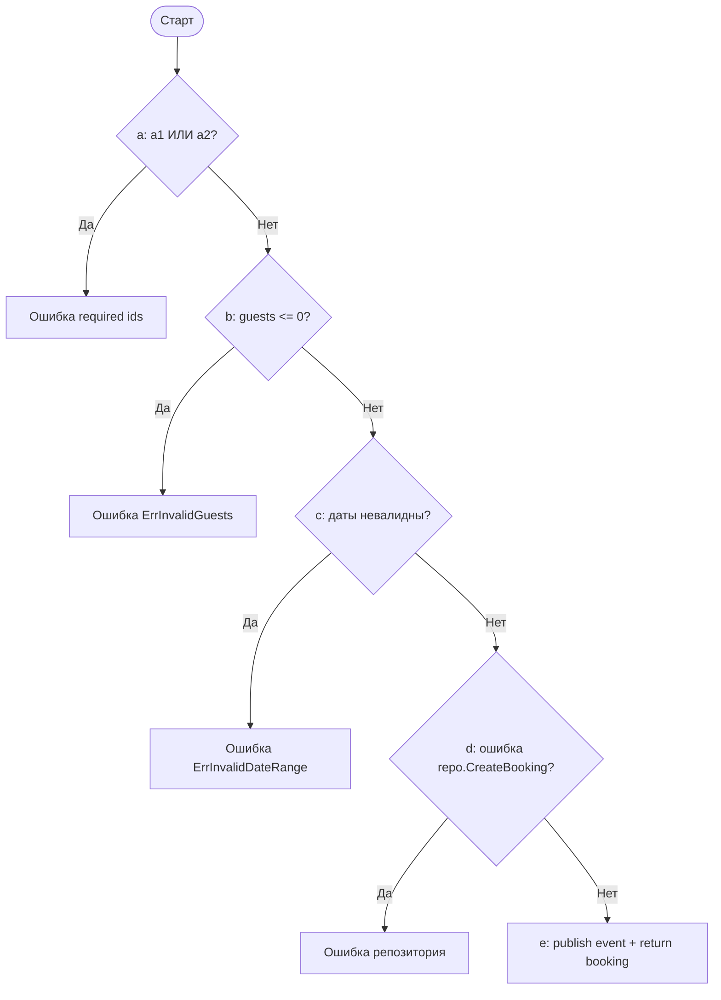
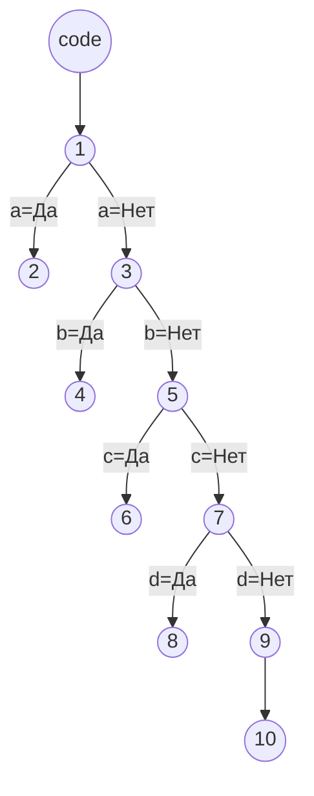

## ЛР2. Тестирование белым ящиком

Функция: `BookingService.CreateBooking`.

Листинг 2 - Фрагмент кода с пометками операторов

```go
func (s *BookingService) CreateBooking(ctx context.Context, traceID string, in CreateBookingInput) (domain.Booking, error) {
	// a: проверка обязательных полей (a1 OR a2)
	// a1: client_id пустой, a2: sanatorium_id пустой
	if strings.TrimSpace(in.ClientID) == "" || strings.TrimSpace(in.SanatoriumID) == "" {
		return domain.Booking{}, fmt.Errorf("client_id and sanatorium_id are required")
	}

	// b: проверка количества гостей
	if in.Guests <= 0 {
		return domain.Booking{}, ErrInvalidGuests
	}

	// c: проверка диапазона дат
	if err := ValidateBookingDateRange(in.CheckIn, in.CheckOut); err != nil {
		return domain.Booking{}, err
	}

	// d: создание в репозитории + проверка ошибки
	booking, err := s.repo.CreateBooking(ctx, repository.NewBooking{
		ClientID:     in.ClientID,
		SanatoriumID: in.SanatoriumID,
		CheckIn:      in.CheckIn,
		CheckOut:     in.CheckOut,
		Guests:       in.Guests,
	})
	if err != nil {
		return domain.Booking{}, err
	}

	// e: публикация события и успешный выход
	s.publishBookingEvent(ctx, traceID, "booking.confirmed", map[string]any{
		"booking_id":    booking.ID,
		"client_id":     booking.ClientID,
		"sanatorium_id": booking.SanatoriumID,
		"check_in":      booking.CheckIn,
		"check_out":     booking.CheckOut,
		"guests":        booking.Guests,
		"status":        booking.Status,
	})
	return booking, nil
}
```

Диаграмма 1 - Логика проверок (для начала раздела ЛР2)



### Часть 1. Покрытие операторов

| № | Операторы | Входные данные | Выходные данные |
|---|---|---|---|
| 1 | `a` | `client_id=""`, `sanatorium_id=uuid`, остальные поля валидны | Ошибка `client_id and sanatorium_id are required` |
| 2 | `a, b` | оба ID валидны, `guests=0` | `ErrInvalidGuests` |
| 3 | `a, b, c` | ID валидны, `guests=2`, `check_out<=check_in` | `ErrInvalidDateRange` |
| 4 | `a, b, c, d` | валидный ввод, `repo.CreateBooking` возвращает ошибку | Ошибка репозитория |
| 5 | `a, b, c, d, e` | валидный ввод, `repo.CreateBooking` успешен | Успешное создание брони |

### Часть 2. Покрытие решений

| № | Решения | Входные данные | Выходные данные |
|---|---|---|---|
| 1 | `a=Да` | пустой хотя бы один ID | Ошибка required ids |
| 2 | `a=Нет, b=Да` | ID валидны, `guests<=0` | `ErrInvalidGuests` |
| 3 | `a=Нет, b=Нет, c=Да` | ID валидны, `guests>0`, невалидные даты | `ErrInvalidDateRange` |
| 4 | `a=Нет, b=Нет, c=Нет, d=Да` | валидный ввод, ошибка репозитория | Ошибка репозитория |
| 5 | `a=Нет, b=Нет, c=Нет, d=Нет` | валидный ввод, repo success | Успех |

### Часть 3. Покрытие условий

| № | Условие | Входные данные | Выходные данные |
|---|---|---|---|
| 1 | `a1=Да, a2=Нет` | `client_id=""`, `sanatorium_id=uuid` | Ошибка required ids |
| 2 | `a1=Нет, a2=Да` | `client_id=uuid`, `sanatorium_id=""` | Ошибка required ids |
| 3 | `a1=Нет, a2=Нет, b=Да` | ID валидны, `guests=0` | `ErrInvalidGuests` |
| 4 | `a1=Нет, a2=Нет, b=Нет, c=Да` | ID валидны, `guests=2`, даты невалидны | `ErrInvalidDateRange` |
| 5 | `a1=Нет, a2=Нет, b=Нет, c=Нет, d=Да` | валидный ввод, repo error | Ошибка репозитория |
| 6 | `a1=Нет, a2=Нет, b=Нет, c=Нет, d=Нет` | валидный ввод, repo success | Успех |

### Часть 4. Покрытие решений и условий

| № | Условие | Входные данные | Выходные данные |
|---|---|---|---|
| 1 | `a=Да` (`a1=Да, a2=Нет`) | пустой `client_id` | Ошибка required ids |
| 2 | `a=Да` (`a1=Нет, a2=Да`) | пустой `sanatorium_id` | Ошибка required ids |
| 3 | `a=Нет, b=Да` | `guests=0` | `ErrInvalidGuests` |
| 4 | `a=Нет, b=Нет, c=Да` | невалидные даты | `ErrInvalidDateRange` |
| 5 | `a=Нет, b=Нет, c=Нет, d=Да` | repo error | Ошибка репозитория |
| 6 | `a=Нет, b=Нет, c=Нет, d=Нет` | repo success | Успех |

### Часть 5. Комбинаторное покрытие условий

| № | Условие | Входные данные | Выходные данные |
|---|---|---|---|
| 1 | `a1=Да, a2=Да` | оба ID пустые | Ошибка required ids |
| 2 | `a1=Да, a2=Нет` | пустой `client_id` | Ошибка required ids |
| 3 | `a1=Нет, a2=Да` | пустой `sanatorium_id` | Ошибка required ids |
| 4 | `a1=Нет, a2=Нет, b=Да` | `guests=0` | `ErrInvalidGuests` |
| 5 | `a1=Нет, a2=Нет, b=Нет, c=Да` | невалидные даты | `ErrInvalidDateRange` |
| 6 | `a1=Нет, a2=Нет, b=Нет, c=Нет, d=Да` | repo error | Ошибка репозитория |
| 7 | `a1=Нет, a2=Нет, b=Нет, c=Нет, d=Нет` | repo success | Успех |

### Часть 6. Управляющий граф программы

Вершины графа:
- `code`: вход в функцию `CreateBooking`
- `1`: проверка `a` (`a1 OR a2`)
- `2`: `return required ids`
- `3`: проверка `b`
- `4`: `return ErrInvalidGuests`
- `5`: проверка `c`
- `6`: `return ErrInvalidDateRange`
- `7`: проверка `d`
- `8`: `return repo error`
- `9`: `publish event`
- `10`: `return booking, nil`

Ребра (направленные):
- `code -> 1`
- `1 -> 2` (`a=Да`)
- `1 -> 3` (`a=Нет`)
- `3 -> 4` (`b=Да`)
- `3 -> 5` (`b=Нет`)
- `5 -> 6` (`c=Да`)
- `5 -> 7` (`c=Нет`)
- `7 -> 8` (`d=Да`)
- `7 -> 9` (`d=Нет`)
- `9 -> 10`



