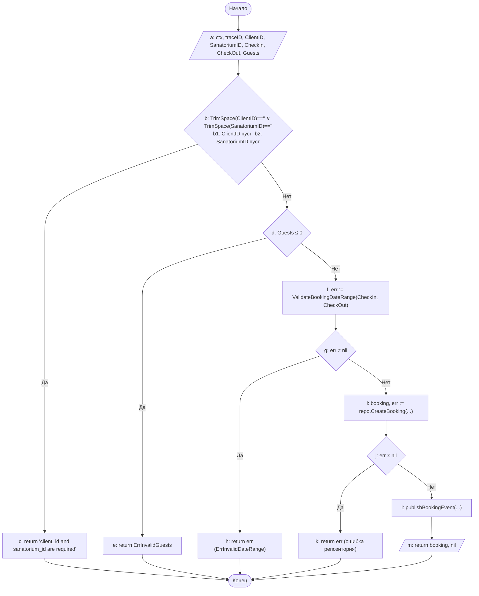
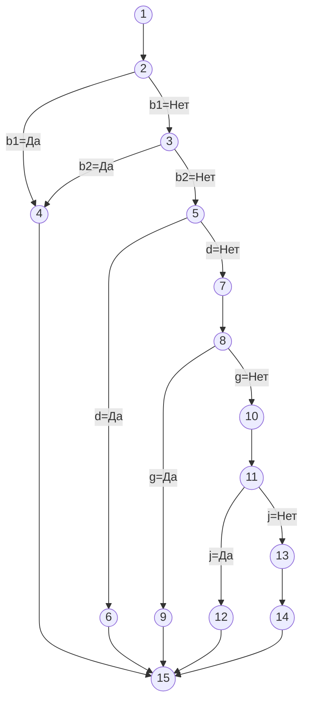

# Лабораторная работа №2. Тестирование белым ящиком

Функция: `BookingService.CreateBooking`
Файл: `src/go-microservices/deal-service/internal/service/booking.go`

---

## Листинг с пометками блоков

```go
// a: ввод — ctx, traceID, in (ClientID, SanatoriumID, CheckIn, CheckOut, Guests)
func (s *BookingService) CreateBooking(ctx context.Context, traceID string, in CreateBookingInput) (domain.Booking, error) {

    // b: условие — TrimSpace(ClientID)==""  ||  TrimSpace(SanatoriumID)==""
    //    b1: TrimSpace(ClientID) == ""
    //    b2: TrimSpace(SanatoriumID) == ""
    if strings.TrimSpace(in.ClientID) == "" || strings.TrimSpace(in.SanatoriumID) == "" {
        // c: return — "client_id and sanatorium_id are required"
        return domain.Booking{}, fmt.Errorf("client_id and sanatorium_id are required")
    }

    // d: условие — Guests <= 0
    if in.Guests <= 0 {
        // e: return — ErrInvalidGuests
        return domain.Booking{}, ErrInvalidGuests
    }

    // f: вызов — err := ValidateBookingDateRange(CheckIn, CheckOut)
    // g: условие — err != nil
    if err := ValidateBookingDateRange(in.CheckIn, in.CheckOut); err != nil {
        // h: return — err (ErrInvalidDateRange)
        return domain.Booking{}, err
    }

    // i: вызов — booking, err := repo.CreateBooking(...)
    booking, err := s.repo.CreateBooking(ctx, repository.NewBooking{
        ClientID:     in.ClientID,
        SanatoriumID: in.SanatoriumID,
        CheckIn:      in.CheckIn,
        CheckOut:     in.CheckOut,
        Guests:       in.Guests,
    })
    // j: условие — err != nil
    if err != nil {
        // k: return — err (ошибка репозитория)
        return domain.Booking{}, err
    }

    // l: вызов — publishBookingEvent(...)
    s.publishBookingEvent(ctx, traceID, "booking.confirmed", map[string]any{
        "booking_id":    booking.ID,
        "client_id":     booking.ClientID,
        "sanatorium_id": booking.SanatoriumID,
        "check_in":      booking.CheckIn,
        "check_out":     booking.CheckOut,
        "guests":        booking.Guests,
        "status":        booking.Status,
    })

    // m: вывод — return booking, nil
    return booking, nil
}
// n: Конец
```

---

## Таблица блоков

| Блок | Тип фигуры | Содержание | Переход |
|------|-----------|-----------|---------|
| a | Параллелограмм (ввод) | Ввод: ctx, traceID, ClientID, SanatoriumID, CheckIn, CheckOut, Guests | → b |
| b | Ромб | `TrimSpace(ClientID)==""` ∨ `TrimSpace(SanatoriumID)==""` (b1 ∨ b2) | Да→c, Нет→d |
| c | Прямоугольник | return `"client_id and sanatorium_id are required"` | → n |
| d | Ромб | `Guests ≤ 0` | Да→e, Нет→f |
| e | Прямоугольник | return `ErrInvalidGuests` | → n |
| f | Прямоугольник | `err := ValidateBookingDateRange(CheckIn, CheckOut)` | → g |
| g | Ромб | `err ≠ nil` | Да→h, Нет→i |
| h | Прямоугольник | return `err` (ErrInvalidDateRange) | → n |
| i | Прямоугольник | `booking, err := repo.CreateBooking(...)` | → j |
| j | Ромб | `err ≠ nil` | Да→k, Нет→l |
| k | Прямоугольник | return `err` (ошибка репозитория) | → n |
| l | Прямоугольник | `publishBookingEvent(...)` | → m |
| m | Параллелограмм (вывод) | return `booking, nil` | → n |
| n | Скруглённый прямоугольник | Конец | — |

---

## Блок-схема программы



---

## Часть 1. Покрытие операторов

Критерий покрытия операторов требует выполнения каждого оператора программы хотя бы один раз.

Блоки c, e, h, k достигаются только по ветвям «Да» соответствующих условий, которые взаимно исключают нижележащие блоки. Поэтому для полного покрытия необходимо 5 тестов.

| № | Операторы | Входные данные | Ожидаемые выходные данные |
|---|-----------|---------------|--------------------------|
| 1 | a, b(Нет), d(Нет), f, g(Нет), i, j(Нет), l, m | `ClientID=uuid-cli`, `SanatoriumID=uuid-san`, `CheckIn=2026-07-10`, `CheckOut=2026-07-15`, `Guests=2`, repo → OK | return `booking` (status=confirmed) |
| 2 | a, b(Да), c | `ClientID=""`, `SanatoriumID=uuid-san`, `CheckIn=2026-07-10`, `CheckOut=2026-07-15`, `Guests=2` | return ошибка `"client_id and sanatorium_id are required"` |
| 3 | a, b(Нет), d(Да), e | `ClientID=uuid-cli`, `SanatoriumID=uuid-san`, `CheckIn=2026-07-10`, `CheckOut=2026-07-15`, `Guests=0` | return `ErrInvalidGuests` |
| 4 | a, b(Нет), d(Нет), f, g(Да), h | `ClientID=uuid-cli`, `SanatoriumID=uuid-san`, `CheckIn=2026-07-15`, `CheckOut=2026-07-10`, `Guests=2` | return `ErrInvalidDateRange` |
| 5 | a, b(Нет), d(Нет), f, g(Нет), i, j(Да), k | `ClientID=uuid-cli`, `SanatoriumID=uuid-san`, `CheckIn=2026-07-10`, `CheckOut=2026-07-15`, `Guests=2`, repo → error | return ошибка репозитория |

---

## Часть 2. Покрытие решений

Критерий покрытия решений требует, чтобы каждое условие-решение (b, d, g, j) приняло значение «Да» и «Нет» хотя бы по одному разу.

| № | Решения | Входные данные | Ожидаемые выходные данные |
|---|---------|---------------|--------------------------|
| 1 | b = Да | `ClientID=""`, остальные валидны | ошибка `"client_id and sanatorium_id are required"` |
| 2 | b = Нет, d = Да | `ClientID=uuid-cli`, `SanatoriumID=uuid-san`, `Guests=0` | `ErrInvalidGuests` |
| 3 | b = Нет, d = Нет, g = Да | валидные ID и Guests, `CheckIn=2026-07-15`, `CheckOut=2026-07-10` | `ErrInvalidDateRange` |
| 4 | b = Нет, d = Нет, g = Нет, j = Да | все поля валидны, repo → error | ошибка репозитория |
| 5 | b = Нет, d = Нет, g = Нет, j = Нет | все поля валидны, repo → OK | return `booking` (status=confirmed) |

---

## Часть 3. Покрытие условий

Критерий покрытия условий требует, чтобы каждое отдельное подусловие (b1, b2, d, g, j) приняло значения «Да» и «Нет» хотя бы по одному разу.

Подусловия: **b1** (`ClientID пуст`), **b2** (`SanatoriumID пуст`), **d** (`Guests ≤ 0`), **g** (`err ≠ nil` после ValidateBookingDateRange), **j** (`err ≠ nil` после repo.CreateBooking).

| № | Условие | Входные данные | Ожидаемые выходные данные |
|---|---------|---------------|--------------------------|
| 1 | b1=Да, b2=Нет | `ClientID=""`, `SanatoriumID=uuid-san`, `CheckIn=2026-07-10`, `CheckOut=2026-07-15`, `Guests=2` | ошибка `"client_id and sanatorium_id are required"` |
| 2 | b1=Нет, b2=Да | `ClientID=uuid-cli`, `SanatoriumID=""`, `CheckIn=2026-07-10`, `CheckOut=2026-07-15`, `Guests=2` | ошибка `"client_id and sanatorium_id are required"` |
| 3 | b1=Нет, b2=Нет, d=Да | `ClientID=uuid-cli`, `SanatoriumID=uuid-san`, `CheckIn=2026-07-10`, `CheckOut=2026-07-15`, `Guests=0` | `ErrInvalidGuests` |
| 4 | b1=Нет, b2=Нет, d=Нет, g=Да | `ClientID=uuid-cli`, `SanatoriumID=uuid-san`, `CheckIn=2026-07-15`, `CheckOut=2026-07-10`, `Guests=2` | `ErrInvalidDateRange` |
| 5 | b1=Нет, b2=Нет, d=Нет, g=Нет, j=Да | все валидно, repo → error | ошибка репозитория |
| 6 | b1=Нет, b2=Нет, d=Нет, g=Нет, j=Нет | все валидно, repo → OK | return `booking` (status=confirmed) |

Тесты 1 и 2 покрывают b1=Да, b1=Нет, b2=Да, b2=Нет. Тест 3 — d=Да, тесты 4–6 — d=Нет. Тест 4 — g=Да, тесты 5–6 — g=Нет. Тест 5 — j=Да, тест 6 — j=Нет. Все 10 значений подусловий покрыты.

---

## Часть 4. Покрытие решений и условий

Критерий требует одновременного выполнения покрытия решений и покрытия условий, а также выполнения каждого оператора хотя бы один раз. Представляется как покрытие маршрутов: найти все пути от **a** до **n**.

| № | Маршрут | Входные данные | Ожидаемые выходные данные |
|---|---------|---------------|--------------------------|
| 1 | a, b(Да: b1=Да, b2=Нет), c, n | `ClientID=""`, `SanatoriumID=uuid-san`, `CheckIn=2026-07-10`, `CheckOut=2026-07-15`, `Guests=2` | ошибка `"client_id and sanatorium_id are required"` |
| 2 | a, b(Да: b1=Нет, b2=Да), c, n | `ClientID=uuid-cli`, `SanatoriumID=""`, `CheckIn=2026-07-10`, `CheckOut=2026-07-15`, `Guests=2` | ошибка `"client_id and sanatorium_id are required"` |
| 3 | a, b(Нет), d(Да), e, n | `ClientID=uuid-cli`, `SanatoriumID=uuid-san`, `CheckIn=2026-07-10`, `CheckOut=2026-07-15`, `Guests=0` | `ErrInvalidGuests` |
| 4 | a, b(Нет), d(Нет), f, g(Да), h, n | `ClientID=uuid-cli`, `SanatoriumID=uuid-san`, `CheckIn=2026-07-15`, `CheckOut=2026-07-10`, `Guests=2` | `ErrInvalidDateRange` |
| 5 | a, b(Нет), d(Нет), f, g(Нет), i, j(Да), k, n | все валидно, repo → error | ошибка репозитория |
| 6 | a, b(Нет), d(Нет), f, g(Нет), i, j(Нет), l, m, n | все валидно, repo → OK | return `booking` (status=confirmed) |

---

## Часть 5. Комбинаторное покрытие условий

Критерий требует охватить все возможные комбинации значений подусловий в каждом решении.

Решение **b** содержит два подусловия (b1, b2), образующих 4 комбинации. Решения **d**, **g**, **j** — по одному подусловию. Так как условия b, d, g, j вычисляются последовательно с досрочным выходом, полный перебор дал бы 4 × 2 × 2 × 2 = 32 комбинации. С учётом ранних возвратов реально достижимых путей 6 (равно CC). Для покрытия всех комбинаций b1/b2 и всех ветвей d, g, j достаточно 7 тестов.

Все комбинации значений условий:

1. b1 = Да, b2 = Да
2. b1 = Да, b2 = Нет
3. b1 = Нет, b2 = Да
4. b1 = Нет, b2 = Нет; d = Да
5. b1 = Нет, b2 = Нет; d = Нет; g = Да
6. b1 = Нет, b2 = Нет; d = Нет; g = Нет; j = Да
7. b1 = Нет, b2 = Нет; d = Нет; g = Нет; j = Нет

| № | Условие | Входные данные | Ожидаемые выходные данные |
|---|---------|---------------|--------------------------|
| 1 | b(Да&Да=Да), c, n | `ClientID=""`, `SanatoriumID=""`, `CheckIn=2026-07-10`, `CheckOut=2026-07-15`, `Guests=2` | ошибка `"client_id and sanatorium_id are required"` |
| 2 | b(Да&Нет=Да), c, n | `ClientID=""`, `SanatoriumID=uuid-san`, `CheckIn=2026-07-10`, `CheckOut=2026-07-15`, `Guests=2` | ошибка `"client_id and sanatorium_id are required"` |
| 3 | b(Нет&Да=Да), c, n | `ClientID=uuid-cli`, `SanatoriumID=""`, `CheckIn=2026-07-10`, `CheckOut=2026-07-15`, `Guests=2` | ошибка `"client_id and sanatorium_id are required"` |
| 4 | b(Нет&Нет=Нет), d(Да), e, n | `ClientID=uuid-cli`, `SanatoriumID=uuid-san`, `CheckIn=2026-07-10`, `CheckOut=2026-07-15`, `Guests=0` | `ErrInvalidGuests` |
| 5 | b(Нет), d(Нет), g(Да), h, n | `ClientID=uuid-cli`, `SanatoriumID=uuid-san`, `CheckIn=2026-07-15`, `CheckOut=2026-07-10`, `Guests=2` | `ErrInvalidDateRange` |
| 6 | b(Нет), d(Нет), g(Нет), j(Да), k, n | все валидно, repo → error | ошибка репозитория |
| 7 | b(Нет), d(Нет), g(Нет), j(Нет), l, m, n | все валидно, repo → OK | return `booking` (status=confirmed) |

---

## Часть 6. Управляющий граф программы

### Вершины графа

Оператор `||` в условии b разбивается на два узла (b1 и b2), что корректно отражает фактическое число независимых путей.

| № | Метка | Описание |
|---|-------|----------|
| 1 | — | Вход в функцию (начало) |
| 2 | b1 | Условие: `TrimSpace(ClientID) == ""` |
| 3 | b2 | Условие: `TrimSpace(SanatoriumID) == ""` |
| 4 | c | return `"client_id and sanatorium_id are required"` |
| 5 | d | Условие: `Guests ≤ 0` |
| 6 | e | return `ErrInvalidGuests` |
| 7 | f | `err := ValidateBookingDateRange(CheckIn, CheckOut)` |
| 8 | g | Условие: `err ≠ nil` |
| 9 | h | return `err` (ErrInvalidDateRange) |
| 10 | i | `booking, err := repo.CreateBooking(...)` |
| 11 | j | Условие: `err ≠ nil` |
| 12 | k | return `err` (ошибка репозитория) |
| 13 | l | `publishBookingEvent(...)` |
| 14 | m | return `booking, nil` |
| 15 | — | Выход из функции (конец) |

### Рёбра графа

| Ребро | Из | В | Условие |
|-------|-----|---|---------|
| 1 | 1 | 2 | — |
| 2 | 2 | 4 | b1 = Да |
| 3 | 2 | 3 | b1 = Нет |
| 4 | 3 | 4 | b2 = Да |
| 5 | 3 | 5 | b2 = Нет |
| 6 | 4 | 15 | — |
| 7 | 5 | 6 | d = Да |
| 8 | 5 | 7 | d = Нет |
| 9 | 6 | 15 | — |
| 10 | 7 | 8 | — |
| 11 | 8 | 9 | g = Да |
| 12 | 8 | 10 | g = Нет |
| 13 | 9 | 15 | — |
| 14 | 10 | 11 | — |
| 15 | 11 | 12 | j = Да |
| 16 | 11 | 13 | j = Нет |
| 17 | 12 | 15 | — |
| 18 | 13 | 14 | — |
| 19 | 14 | 15 | — |

### Цикломатическая сложность

N = 15 (вершин), E = 19 (рёбер), P = 1 (компонент связности).

**V(G) = E − N + 2·P = 19 − 15 + 2 = 6**

### Граф потока управления



### Независимые пути (базовое множество)

| № | Путь |
|---|------|
| П1 | 1 → 2(b1=Да) → 4 → 15 |
| П2 | 1 → 2(b1=Нет) → 3(b2=Да) → 4 → 15 |
| П3 | 1 → 2 → 3(b2=Нет) → 5(d=Да) → 6 → 15 |
| П4 | 1 → 2 → 3 → 5(d=Нет) → 7 → 8(g=Да) → 9 → 15 |
| П5 | 1 → 2 → 3 → 5 → 7 → 8(g=Нет) → 10 → 11(j=Да) → 12 → 15 |
| П6 | 1 → 2 → 3 → 5 → 7 → 8 → 10 → 11(j=Нет) → 13 → 14 → 15 |

Количество независимых путей равно цикломатической сложности: **V(G) = 6**.
