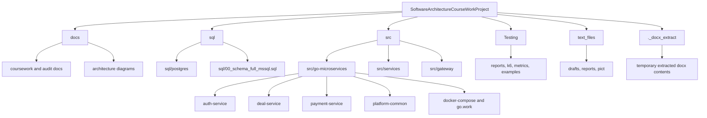
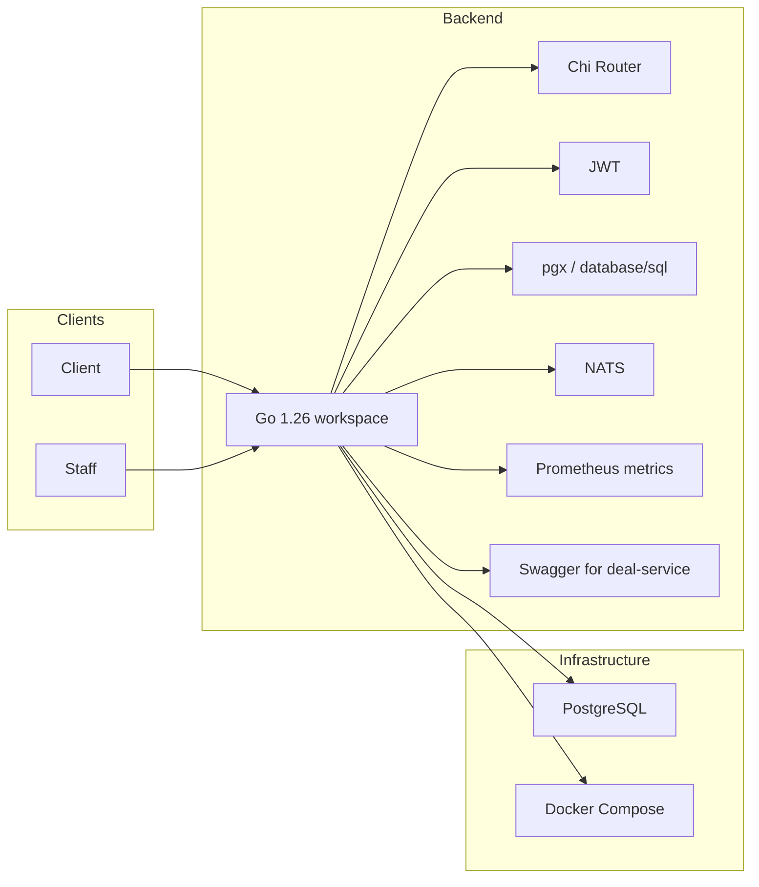
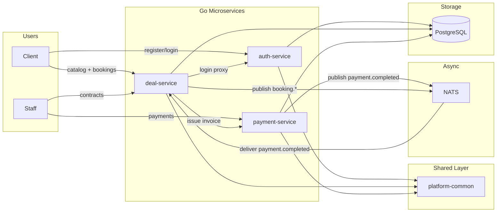
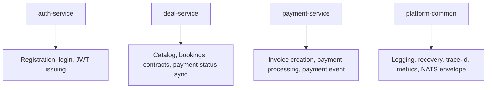
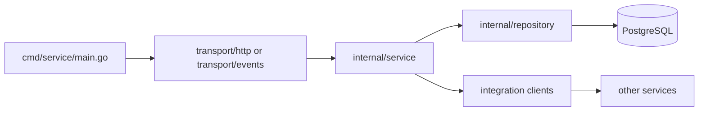
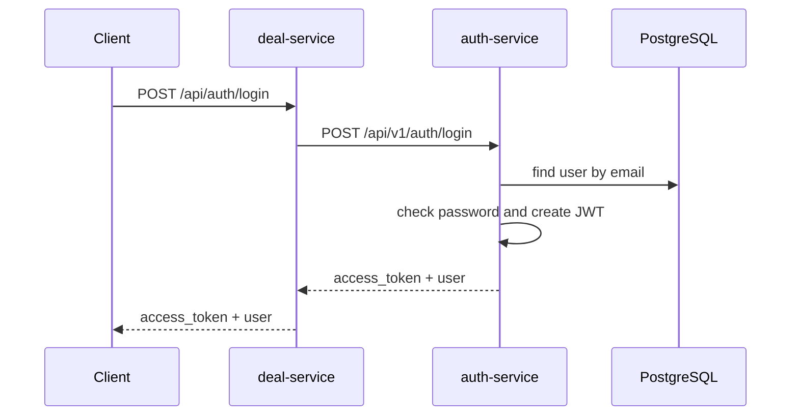
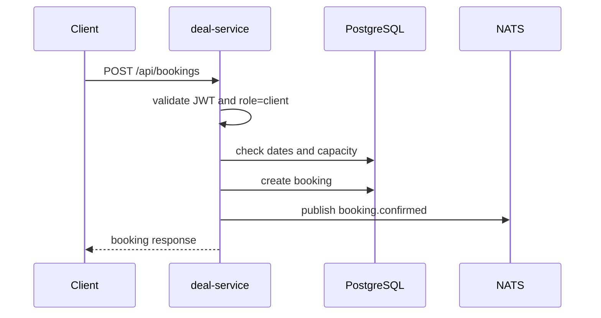
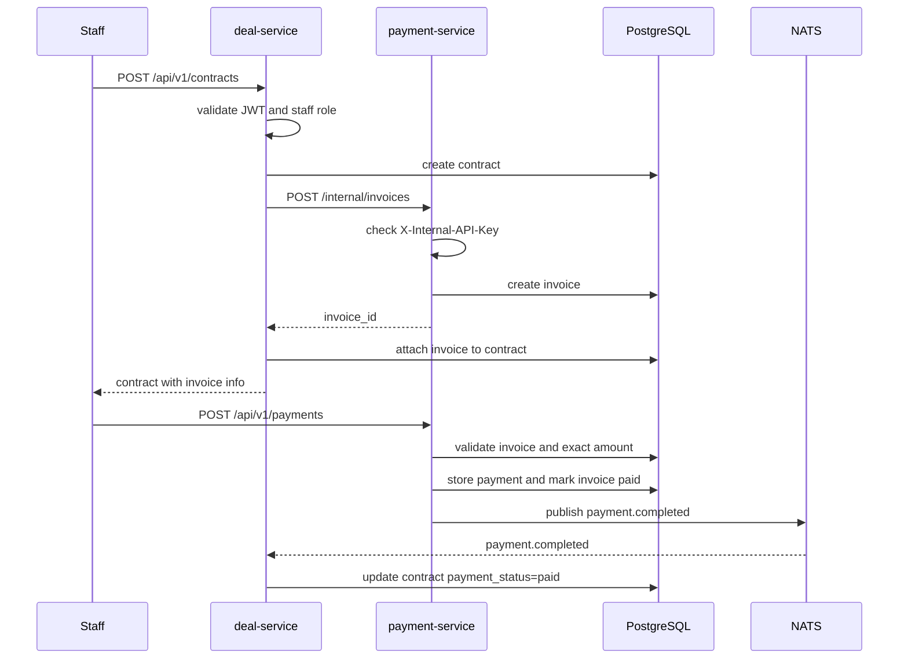
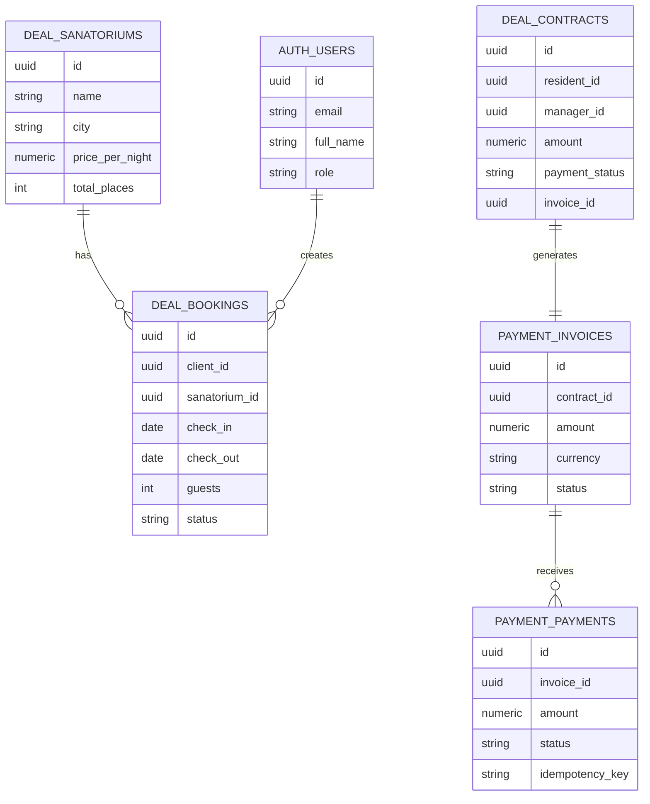
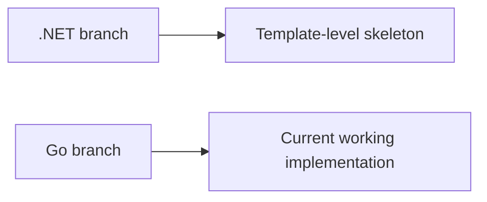

# Project Understanding Guide

Этот документ помогает быстро понять, из чего состоит проект, какая часть является основной, какие технологии используются и как движутся данные между частями системы.

## 1. Что это за проект

Сейчас в репозитории есть **две линии развития**:

- **Основная и рабочая**: `src/go-microservices`
- **Ранняя/черновая .NET-заготовка**: `src/services` и `src/gateway`

Для понимания текущего проекта нужно смотреть прежде всего на Go-реализацию.

## 2. Карта всего репозитория

## 3. Какие части проекта реально важны

### Актуальная система

- `src/go-microservices/auth-service`
- `src/go-microservices/deal-service`
- `src/go-microservices/payment-service`
- `src/go-microservices/platform-common`
- `sql/postgres`
- `docs`

### Неосновная часть

- `src/services`
- `src/gateway`

Эти каталоги сейчас больше похожи на след от раннего варианта архитектуры на `.NET`: там есть шаблонные `Program.cs`, `weatherforecast`, `Class1.cs`, но почти нет предметной логики.

### Поддерживающие материалы

- `Testing`
- `text_files`
- часть generated и учебных документов

Они важны для отчётов и учебного процесса, но не определяют, как работает основная система.

## 4. Технологический стек

## 5. Основная runtime-архитектура

## 6. За что отвечает каждый сервис

### `auth-service`

- регистрация пользователя;
- логин;
- выпуск JWT;
- хранение пользователей в схеме `auth`.

### `deal-service`

- каталог санаториев;
- фильтрация и просмотр карточек;
- создание, изменение и отмена бронирований;
- создание договоров;
- обновление статуса оплаты договора после события из `payment-service`.

### `payment-service`

- создание инвойса для договора;
- обработка платежа;
- публикация события `payment.completed`;
- хранение инвойсов и платежей в схеме `payment`.

### `platform-common`

- middleware;
- trace id;
- JSON helper;
- логирование;
- Prometheus metrics;
- общие обёртки вокруг NATS.

## 7. Внутренняя структура Go-сервисов

Почти каждый сервис устроен одинаково:

Это значит:

- `cmd` собирает приложение и зависимости;
- `transport` принимает HTTP-запросы или события;
- `service` содержит бизнес-логику;
- `repository` работает с БД;
- `integration` вызывает другие сервисы.

## 8. Как проходит логин

Особенность: пользователь логинится через `deal-service`, но сам JWT выпускает `auth-service`.

## 9. Как проходит бронирование

После аудита логика доступности теперь учитывает не просто факт пересечения броней, а суммарное число гостей против `total_places`.

## 10. Как проходит договор и оплата

## 11. Как устроена база данных

Ключевая идея: одна PostgreSQL используется как общее физическое хранилище, но логически она разбита на схемы `auth`, `deal`, `payment`.

## 12. Что с .NET-частью

### Что это означает

- `.NET`-ветка важна как исторический след или альтернативный трек;
- но **не она определяет, как работает проект сейчас**;
- для защиты и дальнейшего развития лучше объяснять именно Go-архитектуру.

## 13. Сильные стороны проекта

- уже есть рабочее разделение на микросервисы;
- есть Docker Compose для локального запуска;
- есть health, metrics, structured logging, trace-id;
- сервисы разделены по ролям и ответственности;
- есть event-driven часть через NATS;
- уже виден переход от курсовой к дипломной архитектуре.

## 14. Ограничения, которые важно понимать

- события работают по MVP-схеме, без надёжной доставки уровня production;
- JWT пока основан на shared secret и локальной проверке в сервисах;
- часть репозитория засорена учебными и документными артефактами;
- покрытие тестами ещё небольшое;
- `.NET`-ветка может путать, если не проговорить, что она не основная.

## 15. В каком порядке изучать проект

1. `docs/project-understanding-guide.md`
2. `docs/project-readiness-audit.md`
3. `src/go-microservices/docker-compose.yml`
4. `src/go-microservices/README.md`
5. `src/go-microservices/auth-service`
6. `src/go-microservices/deal-service`
7. `src/go-microservices/payment-service`
8. `src/go-microservices/platform-common`
9. `sql/postgres`

## 16. Полезные связанные файлы

- `docs/project-readiness-audit.md`
- `docs/project-self-learning-roadmap.md`
- `docs/coursework-go.md`
- `docs/diagrams/go-runtime-overview.mmd`
- `docs/diagrams/booking-payment-sequence.mmd`
- `docs/diagrams/domain-data-model.mmd`
